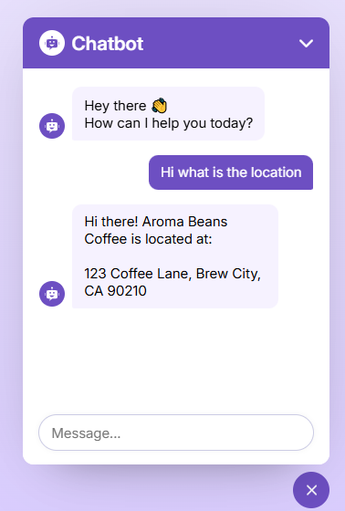

# Steps to build a AI Chatbot:


## Purpose
- The chatbot allows users to send messages and receive intelligent responses using the Gemini API.
  
## Overview
This is a chatbot application built using:
- React for the frontend
- HTML & CSS for structure and styling
- Gemini API (Google's AI model) for natural language processing and for chatbot responses

  
How It Works:
1. **User Input**: The user types a message into a text input.
2. **API Request**: On submit, the message is sent to Gemini API using a fetch or axios call.
3. **AI Response**: The response from Gemini is parsed and displayed in the chat window.
4. **Chat UI**: Messages from both user and bot are styled and rendered in a scrollable chat container.
   

## Project Steps

### 1. Set Up React Project
Initialize a new React app:

  ```bash
  mkdir chatbot
  npm create vite@latest ./ -- --template react
  cd chatbot
  npm install
  npm run dev
  ```

### 2. 📁Project Structure
``` pgsql
chatbot/
├── src/
│   ├── components/
│   │   └── ChatbotIcon.jsx
│   │   └── ChatForm.jsx
│   │   └── ChatMessage.jsx
│   ├── App.jsx
│   ├── index.css
│   └── main.jsx
├── .env
├── index.html
├── package.json
└── README.md
```

### 3. Project Steps

#### 3.a. Create Component Structure using HTML
1. Create a chatbox header, body, footer sections in the App.jsx using HTML.
2. Create a `ChatbotIcon` icon inside the `ChatbotIcon.jsx` component.
3. Create chatbot logo and arrow down logo in the Chatbox header section.
```jsx
<div className='container'>
      <div className='chatbot-popup'>
        {/* Chatbot Header */}
        <div className='chat-header'>
          <div className='header-info'>
            <ChatbotIcon />
            <h2 className='logo-text'>Chatbot</h2>
          </div>
          <button className='material-symbols-rounded'>
            keyboard_arrow_down
          </button>
        </div>
      </div>
    </div>
```
4. Create the bot message text and user message text in the chatbot body.
```jsx
{/* Chatbot Body */}
        <div className='chat-body' ref={chatBodyRef}>
          <div className='message bot-message'>
            <ChatbotIcon />
            <p className='message-text'>
              Hey there 👋
              <br /> How can I help you today?
            </p>
          </div>
          {chatHistory.map((chat, index) => (
            <ChatMessage key={index} chat={chat} />
          ))}
        </div>
```
5. Create the form input and button in the `<ChatForm>` component.
```jsx
return (
    <form action='#' className='chat-form' onSubmit={handleFormSubmit}>
      <input
        ref={inputRef}
        type='text'
        className='message-input'
        placeholder='Message...'
        required
      />
      <button className='material-symbols-rounded'>arrow_upward</button>
    </form>
  );
```
6. Call the `<ChatForm>` component in the chatbot footer.
```jsx
 {/* Chatbot Footer */}
        <div className='chat-footer'>
          <ChatForm/>
        </div>
```
<hr>

#### 3.b. Style the UI using CSS
1. Style all the sections as needed using CSS in index.css file.

<hr>

#### 3.c. Handle user submit using useRef
1. Create a **handleFormSubmit** function to handle user submission in the `<ChatForm>` component.
   
2. Inside the **handleFormSubmit** function, use useRef Hook to access the input value provided by the user, log the user input in the console and clear the input after clicking submit button.
   
3. Store the input value in a **userMessage** variable inside the **handleFormSubmit** function.

`ChatForm.jsx`:
```jsx
import { useRef } from 'react';

const ChatForm = () => {
const inputRef = useRef();

const handleFormSubmit = (e) => {
    e.preventDefault();
    const userMessage = inputRef.current.value.trim();
    if (!userMessage) return;
    inputRef.current.value = '';
  };
  return (
  <form action='#' className='chat-form' onSubmit={handleFormSubmit}>
    <input
      ref={inputRef}
      type='text'
      className='message-input'
      placeholder='Message...'
      required
    />
    <button className='material-symbols-rounded'>arrow_upward</button>
  </form>
);
};

export default ChatForm;
```
<hr>   

#### 3.d. Manage State, User and Bot response: 

1. Use useState hook to create a **chatHistory** and **setChatHistory** state in the `App.jsx` and pass this as a props to the `<ChatForm>` component.
   
`App.jsx`:
```jsx
 const [chatHistory, setChatHistory] = useState([]);
.....
  {/* Chatbot Footer */}
        <div className='chat-footer'>
          <ChatForm
            chatHistory={chatHistory}
            setChatHistory={setChatHistory}
          />
        </div>
```
   
1. **Update chat history with the user's message**: In `<ChatForm>` component, inside **handleFormSubmit** function, call the **setChatHistory** setter function, add a arrow function with parameter "**history**" and inside the function body return a array with spreading all the previous history as a first item and then create a object with role attribute and text attribute as a second item. Assign **userMessage** as the value to the text attribute and assign "**user**" as value for the role attribute.

```jsx
 // Update chat history with the user's message
    setChatHistory((history) => [
      ...history,
      { role: 'user', text: userMessage },
    ]);
```

2. In App.jsx, iterate the chatHistory state using map function and call a `<ChatMessage>` component inside the map function.  

```jsx
{/* Chatbot Body */}
        <div className='chat-body' ref={chatBodyRef}>
          <div className='message bot-message'>
            <ChatbotIcon />
            <p className='message-text'>
              Hey there 👋
              <br /> How can I help you today?
            </p>
          </div>
          {chatHistory.map((chat, index) => (
            <ChatMessage key={index} chat={chat} />
          ))}
        </div>
``` 

3. Make chat message dynamic on basis of role by a creating a `<ChatMessage>` component and inside the `<ChatMessage>` render the user or bot message based on the role condition.

`ChatMessage.jsx`:
```jsx
import ChatbotIcon from './ChatbotIcon';

const ChatMessage = ({ chat }) => {
  return (
    <div
      className={`message ${chat.role === 'model' ? 'bot' : 'user'}-message`}>
      {chat.role === 'model' && <ChatbotIcon />}
      <p className='message-text'>{chat.text}</p>
    </div>
  );
};

export default ChatMessage;
```   

4. **Add a "thinking.." placeholder for the bot's response**:  In `<ChatForm>` component, inside **handleFormSubmit** function, call the **setChatHistory** setter function, add a arrow function with parameter "**history**" and inside the function body return a array with spreading all the previous history as a first item and then create a object with role attribute, text attribute as second item. assign "**Thinking...**" as the value to the text attribute and assign "**model**" as value for the role attribute. Wrap the **setChatHistory** setter function inside a setTimeout() function with 600ms delay.

```jsx
// Add a "thinking.." placeholder for the bot's response
    setTimeout(() => {
      setChatHistory((history) => [
        ...history,
        { role: 'model', text: 'Thinking...' },
      ]);
```

5. **Function to generate the bot's response**: Create a generateBotResponse function in App.jsx and pass this function as props to `<ChatForm>` component. inside **handleFormSubmit** function and inside **setTimeout** function, call the **generateBotResponse** function, pass a array as argument and inside array,  spread the chatHistory state variable as first value and pass a object with {role:'user', text: userMessage} as the second value. 
   
Note: the **generateBotResponse** function should be called inside the **setTimeout** function.

```jsx
`App.jsx`
const generateBotResponse = (history) => {
  console.log(history);
};

`ChatForm.jsx`
// Add a "thinking.." placeholder for the bot's response
    setTimeout(() => {
      setChatHistory((history) => [
        ...history,
        { role: 'model', text: 'Thinking...' },
      ]);

      // Call the function to generate the bot's response
      generateBotResponse([
        ...chatHistory,
        { role: 'user', text: userMessage },
      ]);
    }, 600);
```

Complete Code of `ChatForm.jsx`:
```jsx
import { useRef } from 'react';

const ChatForm = ({ chatHistory, setChatHistory, generateBotResponse }) => {
  const inputRef = useRef();

  const handleFormSubmit = (e) => {
    e.preventDefault();
    const userMessage = inputRef.current.value.trim();
    if (!userMessage) return;
    inputRef.current.value = '';

    // Update chat history with the user's message
    setChatHistory((history) => [
      ...history,
      { role: 'user', text: userMessage },
    ]);

    // Add a "thinking.." placeholder for the bot's response
    setTimeout(() => {
      setChatHistory((history) => [
        ...history,
        { role: 'model', text: 'Thinking...' },
      ]);

      // Call the function to generate the bot's response
      generateBotResponse([
        ...chatHistory,
        { role: 'user', text: userMessage },
      ]);
    }, 600);
  };

  return (
    <form action='#' className='chat-form' onSubmit={handleFormSubmit}>
      <input
        ref={inputRef}
        type='text'
        className='message-input'
        placeholder='Message...'
        required
      />
      <button className='material-symbols-rounded'>arrow_upward</button>
    </form>
  );
};

export default ChatForm;
```
<hr>

#### 3.e. Integrate Gemini API 
1. Sign up and get Gemini API key from Google AI Studio.
2. get the text generation code for **REST** method from Gemini API page.
3. Create a .env file in project root and keep the API key info here.
4. Create requestOptions with text generation code format in `App.jsx`.
```jsx
const requestOptions = {
      method: 'POST',
      headers: { 'Content-Type': 'application/json', 'X-goog-api-key': apiKey },
      body: JSON.stringify({ contents: history }),
    };
```

5. Format chat history for API request.
```jsx
 // Format chat history for API request
    history = history.map(({ role, text }) => ({ role, parts: [{ text }] }));
```

6. In App.jsx, use fetch method to send user input to the Gemini API and get the response.
  ``` jsx
  try {
        // Make API call to get the bot's response
        const response = await fetch(url, requestOptions);
        const data = await response.json();
        if (!response.ok)
          throw new Error(data.error.message || 'Something went wrong!');

        // Clean and update chat history with bot's response
        const apiResponseText = data.candidates[0].content.parts[0].text
          .replace(/\*\*(.*?)\*\*/g, '$1')
          .trim();
        updateHistory(apiResponseText);
      } catch (error) {
        console.log(error);
      }
  ```

7. Create a Helper function **updateHistory** to update chat history.
``` jsx
// Helper function to update chat history
    const updateHistory = (text) => {
      setChatHistory((prev) => [
        ...prev.filter((msg) => msg.text !== 'Thinking...'),
        { role: 'model', text },
      ]);
    };
```
8. Auto-scroll using useRef and useEffect Hook
```jsx
const App = () => {
  const [chatHistory, setChatHistory] = useState([]);
  const chatBodyRef = useRef();

.....
{/* Chatbot Body */}
        <div className='chat-body' ref={chatBodyRef}>
          <div className='message bot-message'>
            <ChatbotIcon />

.....
useEffect(() => {
    // Auto-scroll whenever chat history updates
    chatBodyRef.current.scrollTo({
      top: chatBodyRef.current.scrollHeight,
      behavior: 'smooth',
    });
  }, [chatHistory]);

}
```

Complete Code of `App.jsx`:
```jsx
import { useState, useRef, useEffect } from 'react';
import ChatbotIcon from './components/ChatbotIcon';
import ChatForm from './components/ChatForm';
import ChatMessage from './components/ChatMessage';

const App = () => {
  const [chatHistory, setChatHistory] = useState([]);
  const chatBodyRef = useRef();

  const generateBotResponse = async (history) => {
    const url = import.meta.env.VITE_GEMINI_API_URL;
    const apiKey = import.meta.env.VITE_GEMINI_API_KEY;

    // Helper function to update chat history
    const updateHistory = (text) => {
      setChatHistory((prev) => [
        ...prev.filter((msg) => msg.text !== 'Thinking...'),
        { role: 'model', text },
      ]);
    };

    // Format chat history for API request
    history = history.map(({ role, text }) => ({ role, parts: [{ text }] }));

    const requestOptions = {
      method: 'POST',
      headers: { 'Content-Type': 'application/json', 'X-goog-api-key': apiKey },
      body: JSON.stringify({ contents: history }),
    };

    try {
      // Make API call to get the bot's response
      const response = await fetch(url, requestOptions);
      const data = await response.json();
      if (!response.ok)
        throw new Error(data.error.message || 'Something went wrong!');

      // Clean and update chat history with bot's response
      const apiResponseText = data.candidates[0].content.parts[0].text
        .replace(/\*\*(.*?)\*\*/g, '$1')
        .trim();
      updateHistory(apiResponseText);
    } catch (error) {
      console.log(error);
    }
  };

  useEffect(() => {
    // Auto-scroll whenever chat history updates
    chatBodyRef.current.scrollTo({
      top: chatBodyRef.current.scrollHeight,
      behavior: 'smooth',
    });
  }, [chatHistory]);

  return (
    <div className='container'>
      <div className='chatbot-popup'>
        {/* Chatbot Header */}
        <div className='chat-header'>
          <div className='header-info'>
            <ChatbotIcon />
            <h2 className='logo-text'>Chatbot</h2>
          </div>
          <button className='material-symbols-rounded'>
            keyboard_arrow_down
          </button>
        </div>

        {/* Chatbot Body */}
        <div className='chat-body' ref={chatBodyRef}>
          <div className='message bot-message'>
            <ChatbotIcon />
            <p className='message-text'>
              Hey there 👋
              <br /> How can I help you today?
            </p>
          </div>
          {chatHistory.map((chat, index) => (
            <ChatMessage key={index} chat={chat} />
          ))}
        </div>

        {/* Chatbot Footer */}
        <div className='chat-footer'>
          <ChatForm
            chatHistory={chatHistory}
            setChatHistory={setChatHistory}
            generateBotResponse={generateBotResponse}
          />
        </div>
      </div>
    </div>
  );
};
export default App;
```
<hr>

#### 3.f. Add Chatbot Popup Toggle Button
1. Create 2 toggle buttons to show and hide Chatbot popup.
2. Create a **showChatbot** state and setter function with value as false.
3. Create CSS classes to show and the hide Chatbot popup based on **showChatbot** state variable.
4. Create transforms and transitions to display the toggle action gracefully.
5. Create Responsive Design for small screen size viewport.

``` jsx
<div className={`container ${showChatbot ? 'show-chatbot' : ''}`}>
      <button
        id='chatbot-toggler'
        onClick={() => setShowChatbot((prev) => !prev)}>
        <span className='material-symbols-rounded'>mode_comment</span>
        <span className='material-symbols-rounded'>close</span>
      </button>
```
```jsx
      <button
        onClick={() => setShowChatbot((prev) => !prev)}
        className='material-symbols-rounded'>
        keyboard_arrow_down
      </button>
```
<hr>

#### 3.g. Manage Error Handling
1. Catch the error from the Catch block and pass the error message as the first argument and pass the isError boolean value as the second parameter to the **updateHistory** function.
2. Create a isError parameter with default boolean value a false.
3. Add the isError as the third value in the array inside the setChatHistory setter function.

```jsx
// Helper function to update chat history
    const updateHistory = (text, isError = false) => {
      setChatHistory((prev) => [
        ...prev.filter((msg) => msg.text !== 'Thinking...'),
        { role: 'model', text, isError },
      ]);
    };
```

```jsx
 // Clean and update chat history with bot's response
  const apiResponseText = data.candidates[0].content.parts[0].text
    .replace(/\*\*(.*?)\*\*/g, '$1')
    .trim();
  updateHistory(apiResponseText);
} catch (error) {
  updateHistory(error.message, true);
}
```
`ChatMessage.jsx`
```jsx
const ChatMessage = ({ chat }) => {
return (
  !chat.hideInChat && (
    <div
      className={`message ${chat.role === 'model' ? 'bot' : 'user'}-message ${
        chat.isError ? 'error' : '' }`}>
      {chat.role === 'model' && <ChatbotIcon />}
      <p className='message-text'>{chat.text}</p>
    </div>
  )
);
};
```


<hr>

#### 3.h. Customize Responses with Company data & User data 

1. Copy and paste companyInfo into a js file.
2. Assign the companyInfo as the initial state text value.
3. Hide the Initial text message on basis of hideInChat boolean value.

```jsx
import { companyInfo } from './components/companyInfo';

 const [chatHistory, setChatHistory] = useState([
    {
      hideInChat: true,
      role: 'model',
      text: companyInfo,
    },
  ]);
```

`ChatMessage.jsx`
```jsx
const ChatMessage = ({ chat }) => {
return (
  !chat.hideInChat && (
    <div
      className={`message ${chat.role === 'model' ? 'bot' : 'user'}-message ${
        chat.isError ? 'error' : '' }`}>
      {chat.role === 'model' && <ChatbotIcon />}
      <p className='message-text'>{chat.text}</p>
    </div>
  )
);
};
```

```jsx
// Call the function to generate the bot's response
      generateBotResponse([
        ...chatHistory,
        {
          role: 'user',
          text: `Using the details provided above, please address this query: ${userMessage}`,
        },
      ]);
    }, 600);
```


